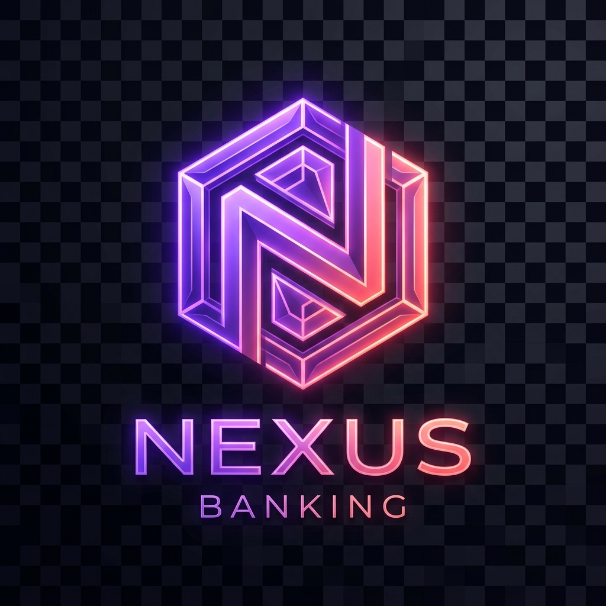

# ⚡ NEXUS Banking

<p align="center">
  
</p>

<p align="center">
  <b>A premium, modern e-banking web application built with React, Vite, and pure CSS keyframe animations.</b>
</p>

<p align="center">
  <a href="#features">Features</a> •
  <a href="#tech-stack">Tech Stack</a> •
  <a href="#getting-started">Getting Started</a> •
  <a href="#design-system">Design System</a> •
  <a href="#pwa-support">PWA</a>
</p>

---

## ✨ Features

- **🍱 Bento Grid Dashboard**: Apple-inspired asymmetric layout featuring total balance, 7-day trend sparklines, circular arc income/expense progress trackers, recent transactions, and quick send bubbles.
- **🐖 Savings Vaults & Auto-Roundup**: Goal-based savings buckets (*Emergency Fund, Vacation, Tech*) with target progress bars, deposit modals, and automatic card purchase roundups.
- **🌍 Multi-Currency & Instant FX Swap**: Hold global balances (**USD, EUR, GBP, JPY**) and perform 1-click currency exchanges at live market rates.
- **📅 Subscriptions & Bill Manager**: Track recurring utilities and subscriptions (*Electricity, Fiber Internet, Rent, Gym*) with 1-click bill payments.
- **💳 3D Interactive Credit Card & Controls**: Interactive 3D mouse-tracking card with holographic shimmer, card freeze/unfreeze toggle, and monthly spending limit slider.
- **📈 Credit Score & Pre-Approved Loans**: FICO 785 credit rating meter, score breakdown factors, and pre-approved instant loan deposit application ($1,000 – $15,000).
- **🪙 Investments & Crypto Watchlist**: Real-time stock & crypto holdings tracker (AAPL, TSLA, BTC, ETH) with 24h gain/loss metrics.
- **⚓ Centered Floating Bottom Navbar**: A glassmorphism navigation pill centered at the bottom of the screen with quick dark mode toggle.
- **🔐 Full Authentication Flow**: Split-screen login & signup interface with floating label inputs and `AuthContext` state guard.
- **📊 Transaction History & Export**: Complete history page with real-time text search, category filter pills, pagination, and **one-click Export to CSV / JSON**.
- **🧾 Transaction Receipt Modal**: Click any transaction on the dashboard or history page to open an interactive receipt modal with reference copying and receipt downloads.
- **⚡ Simulated Backend API & Persistence**: Real-time balance and transaction sync powered by a local REST-like API service (`api.js`) storing data in `localStorage`.
- **📱 PWA & Offline Support**: Service Worker (`sw.js`) and `manifest.json` configured for home screen installation on mobile devices.

---

## 🛠️ Tech Stack

- **Framework**: [React 19](https://react.dev/) + [Vite](https://vite.dev/)
- **Typography**: [Space Grotesk](https://fonts.google.com/specimen/Space+Grotesk) (Headings) & [DM Sans](https://fonts.google.com/specimen/DM+Sans) (Body)
- **Icons**: [Lucide React](https://lucide.dev/)
- **Styling & Animations**: Pure Vanilla CSS (`@keyframes`, CSS variables, Glassmorphism, 3D perspective transforms) — zero heavy chart or animation libraries
- **PWA**: Service Worker caching + Web App Manifest

---

## 🚀 Getting Started

### Prerequisites

- Node.js (v18 or higher recommended)
- npm or yarn

### Installation

1. Clone the repository:
   ```bash
   git clone https://github.com/FinnSkers/NEXUSbanking.git
   cd NEXUSbanking
   ```

2. Install dependencies:
   ```bash
   npm install
   ```

3. Start the development server:
   ```bash
   npm run dev
   ```

4. Open your browser at `http://localhost:5173`.

---

## 📦 Production Build

To build the project for production:

```bash
npm run build
```

Preview the production build locally:

```bash
npm run preview
```

---

## 🎨 Design System

| Element | Specification |
|---|---|
| **Light Theme Base** | Warm Cream `#faf8f5` |
| **Dark Theme Base** | Slate `#0f172a` / `#1e293b` |
| **Primary Accent** | Coral `#ff6b6b` → Violet `#8b5cf6` → Indigo `#6366f1` |
| **Secondary Accents** | Emerald `#14b8a6` (Income) & Amber `#f59e0b` (Warnings) |
| **Border Radius** | 8px (Sm), 14px (Md), 20px (Lg), 999px (Pill) |

---

## 📄 License

Distributed under the MIT License. See `LICENSE` for more information.
